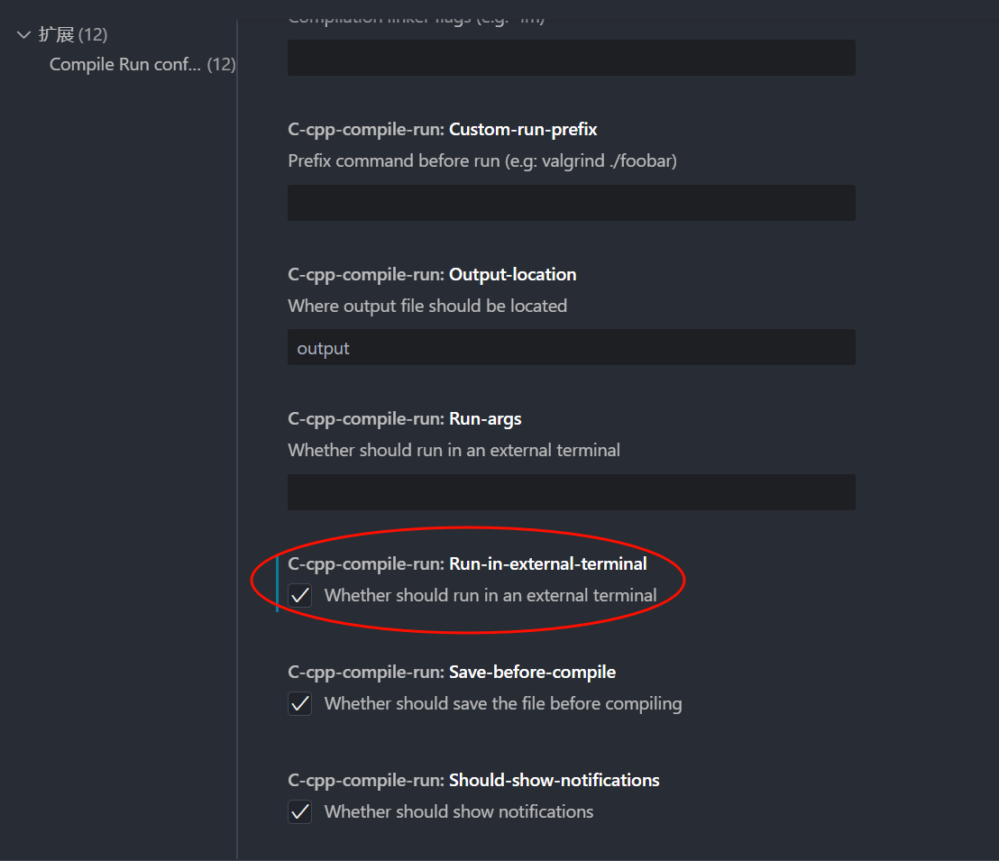

# 这是一个简单的如何在VSCode上配置C++的小白教程

## 1. 安装VSCode
首先，我们需要安装VSCode。你可以从[VSCode官网](https://code.visualstudio.com/)下载并安装VSCode。


## 2. 配置C++编译器
1. MinGW是一个常用的C++编译器，你可以从[MinGW官网](http://www.mingw.org/)下载并安装MinGW。


2. 下载完成后自行选择安装路径(**一定要记住安装路径，后面配置VSCode需要用到。建议和我一样选择安装在D盘，方便后面配置VSCode**)，安装完成后将MinGW的bin目录添加到系统环境变量中。
我这里选择安装在**D盘**，添加**D:\MinGW\bin**到系统环境变量中。


具体步骤如下：
- 打开MinGW安装目录，找到**bin**文件夹，复制**bin**文件夹的路径(也就是**D:\MinGW\bin**)。

- 在桌面中右键点击“此电脑”或“我的电脑”，选择“属性”。
- 点击“高级系统设置”。

- 点击“环境变量”。

- 找到“Path”，并双击“Path”。

- 点击“新建”，将MinGW的bin目录添加到系统环境变量中。

- 一直点击“确定”，保存环境变量。

3. 验证MinGW是否安装成功。
- 使用`win+R`打开命令行，输入`cmd`，回车。

- 输入`gcc -version`，如果出现gcc的版本信息，说明MinGW安装成功。


## 3. 配置VSCode
- 如果是和我一样将MinGW安装在D盘，那么配置VSCode就非常简单了，直接使用我的.vscode文件夹中的配置文件即可（见文末）。

- 如果不是和我一样将MinGW安装在D盘，那么需要修改.vscode文件夹中的c_cpp_properties.json文件和task.json文件中的路径。


## 4. 安装C++插件
在VSCode中，我们需要安装C++插件来支持C++语言的开发。以下我将推荐一些简单实用的插件：

1. 必要的插件：
- C/C++：这是VSCode官方提供的C++插件，支持代码补全、语法高亮、调试等功能。
- C/C++ Extension Pack：这是一个包含多个C++插件的扩展包，包括C/C++、CMake、CodeLLDB等，可以满足大多数C++开发需求。
- C/C++ Compile Run：这是一个C++编译运行插件，可以帮助你快速编译和运行C++代码。
(设置C++编译器路径：扩展 -> C/C++ Compile Run -> 设置 -> C++: Default Compiler Path -> 选择gcc.exe的路径)





2. 可选的插件：
- Chinese (Simplified) Language Pack for Visual Studio Code：这是VSCode的中文语言包，可以让你在VSCode中使用中文界面。
- CodeGeeX：这是一个AI代码生成插件，可以帮助你快速生成代码片段。
- indent-rainbow：这是一个代码缩进插件，可以让你更清晰地看到代码的结构。
- Prettier - Code formatter：这是一个代码格式化插件，可以帮助你统一代码风格。
- Code Spell Checker：这是一个拼写检查插件，可以帮助你检查代码中的拼写错误。
- CodeSnap: 这是一个代码截图插件，可以帮助你快速截图并分享代码。
- ErrorLens：这是一个错误提示插件，可以帮助你快速定位代码中的错误。
- Material Icon Theme：这是一个图标主题插件，可以帮助你美化VSCode的界面。

---
**c_cpp_properties.json文件：**
```json
{
  "configurations": [
    {
      "name": "Win64",
      "includePath": ["${workspaceFolder}/**"],
      "defines": ["_DEBUG", "UNICODE", "_UNICODE"],
      "windowsSdkVersion": "10.0.18362.0",
      "compilerPath": "D:/MinGW/bin/g++.exe",
      "cStandard": "c17",
      "cppStandard": "c++17",
      "intelliSenseMode": "gcc-x64"
    }
  ],
  "version": 4
}
```
---
**tasks.json文件：**
```json
{
    "version": "2.0.0",
    "tasks": [
        {
            "label": "build",
            "type": "shell",
            "group": "build",
            "presentation": {
                "echo": true,
                "reveal": "always",
                "focus": false,
                "panel": "shared"
            },
            "windows": {
                "command": "gcc",
                "args": [
                    "-ggdb",
                    "\"${file}\"",
                    "--std=c99",
                    "-o",
                    "\"${fileDirname}\\${fileBasenameNoExtension}.exe\"",
                    "-finput-charset=UTF-8",
                    "-fexec-charset=UTF-8"
                ]
            }
        },
        {
            "type": "cppbuild",
            "label": "C/C++: g++.exe 生成活动文件",
            "command": "D:/MinGW/bin/g++.exe",
            "args": [
                "-fdiagnostics-color=always",
                "-g",
                "${file}",
                "-o",
                "${fileDirname}\\${fileBasenameNoExtension}.exe"
            ],
            "options": {
                "cwd": "D:/MinGW/bin"
            },
            "problemMatcher": [
                "$gcc"
            ],
            "group": {
                "kind": "build",
                "isDefault": true
            },
            "detail": "调试器生成的任务。"
        }
    ]
}
```
---
**launch.json文件：**
```json
{
  "version": "0.2.0",
  "configurations": [
    {
      "name": "C++ Launch",
      "type": "cppdbg",
      "request": "launch",
      "program": "${fileDirname}\\${fileBasenameNoExtension}.exe",
      "args": [],
      "stopAtEntry": false,
      "cwd": "${workspaceFolder}",
      "environment": [],
      "externalConsole": true,
      "MIMode": "gdb",
      "setupCommands": [{
        "description": "Enable pretty-printing for gdb",
        "text": "-enable-pretty-printing",
        "ignoreFailures": true
      }],
      "preLaunchTask": "build",
      "miDebuggerPath": "D:/MinGW/bin/gdb.exe",
      "logging": {
        "moduleLoad": false,
        "trace": false,
      }
```
---
**settings.json文件：**
```json
{
  "files.associations": {
    "*.py": "python",
    "iostream": "cpp",
    "*.tcc": "cpp",
    "string": "cpp",
    "unordered_map": "cpp",
    "vector": "cpp",
    "ostream": "cpp",
    "new": "cpp",
    "typeinfo": "cpp",
    "deque": "cpp",
    "initializer_list": "cpp",
    "iosfwd": "cpp",
    "fstream": "cpp",
    "sstream": "cpp",
    "map": "c",
    "stdio.h": "c",
    "algorithm": "cpp",
    "atomic": "cpp",
    "bit": "cpp",
    "cctype": "cpp",
    "clocale": "cpp",
    "cmath": "cpp",
    "compare": "cpp",
    "concepts": "cpp",
    "cstddef": "cpp",
    "cstdint": "cpp",
    "cstdio": "cpp",
    "cstdlib": "cpp",
    "cstring": "cpp",
    "ctime": "cpp",
    "cwchar": "cpp",
    "exception": "cpp",
    "ios": "cpp",
    "istream": "cpp",
    "iterator": "cpp",
    "limits": "cpp",
    "memory": "cpp",
    "random": "cpp",
    "set": "cpp",
    "stack": "cpp",
    "stdexcept": "cpp",
    "streambuf": "cpp",
    "system_error": "cpp",
    "tuple": "cpp",
    "type_traits": "cpp",
    "utility": "cpp",
    "xfacet": "cpp",
    "xiosbase": "cpp",
    "xlocale": "cpp",
    "xlocinfo": "cpp",
    "xlocnum": "cpp",
    "xmemory": "cpp",
    "xstddef": "cpp",
    "xstring": "cpp",
    "xtr1common": "cpp",
    "xtree": "cpp",
    "xutility": "cpp",
    "stdlib.h": "c",
    "string.h": "c",
    "string_view": "cpp",
    "regex": "cpp",
    "array": "cpp",
    "bitset": "cpp",
    "cfenv": "cpp",
    "charconv": "cpp",
    "chrono": "cpp",
    "cinttypes": "cpp",
    "codecvt": "cpp",
    "complex": "cpp",
    "condition_variable": "cpp",
    "csetjmp": "cpp",
    "csignal": "cpp",
    "cstdarg": "cpp",
    "cuchar": "cpp",
    "cwctype": "cpp",
    "forward_list": "cpp",
    "list": "cpp",
    "unordered_set": "cpp",
    "functional": "cpp",
    "memory_resource": "cpp",
    "numeric": "cpp",
    "optional": "cpp",
    "ratio": "cpp",
    "future": "cpp",
    "iomanip": "cpp",
    "mutex": "cpp",
    "scoped_allocator": "cpp",
    "shared_mutex": "cpp",
    "thread": "cpp",
    "typeindex": "cpp",
    "valarray": "cpp"
  },
  "editor.suggest.snippetsPreventQuickSuggestions": false,
  "aiXcoder.showTrayIcon": true
}
```